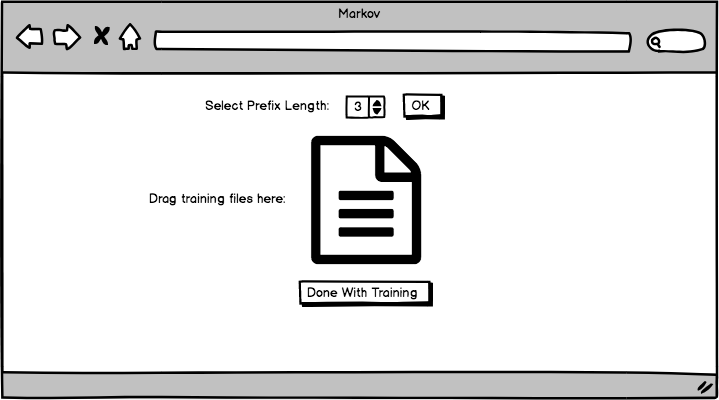

# User Interface proposal

I've assumed that the transformer code has been placed behind a REST API which exposes endpoints to set the prefix 
length value, upload a training file, and obtain a generated text. This would likely
involve adding some external storage for the data sets.

The user's flow will be:

* First, configure the prefix length:

* Next, upload one or more training texts:

* Finally, select a length of output and view the results:

Some enhancements to this might include:

* User authentication
* Adding a UI where the user can create and edit multiple data sets
* Adding a download link for the generated text
